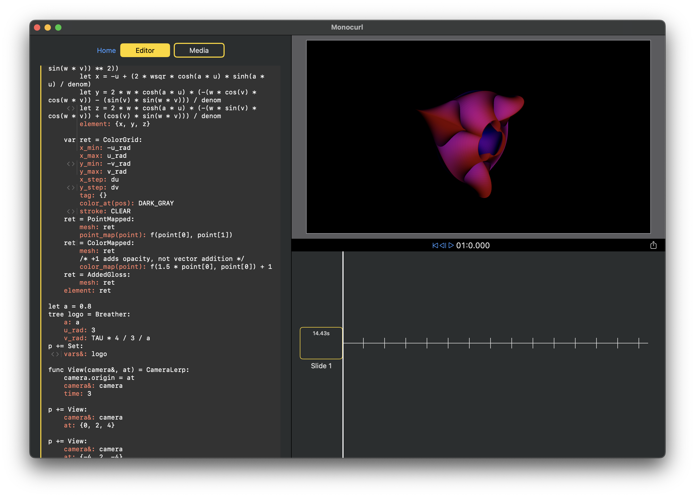
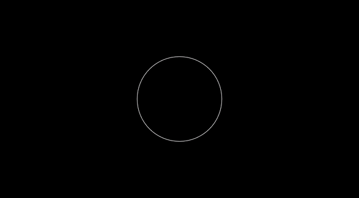

# Monocurl (beta v0.1.0)


*Make videos and slideshow presentations using math*

Monocurl is a scripting language and a desktop application used to create STEM videos and slideshow. The core idea of Monocurl is to combine the benefits of programmatic animations with the traditional feel of a video editor. 

[Website](https://www.monocurl.com/) | [Discord](https://discord.com/invite/7g94JR3SAD)

## Minimal Working Example

```
tree circ = Circle:
    center: ORIGIN
    radius: 1
    tag: {}
    color: default

p += Set:
    vars&: circ

circ = {}
p += Fade:
    meshes&: circ
    time: 1
```

Result:




## High Level Idea

Monocurl combines the idea of keyframes with programmatic animation. In particular, there exists the idea of the iterator and the follower. The iterator is a normal variable that cycles through different key states (e.g. `circ` in the above example). We then tell the follower how to interpolate between the different keyframes using animations (e.g. `Set` and `Fade`). This provides our basis for complex projects.

## Resources

We have a tutorial series available on our [website](https://www.monocurl.com/learn/0_What_is_Monocurl) (and accompany videos on [YouTube](https://www.youtube.com/@monocurl) as well).

Please feel free to ask for help (or contribute ideas) in our [Discord](https://discord.com/invite/7g94JR3SAD) server!
