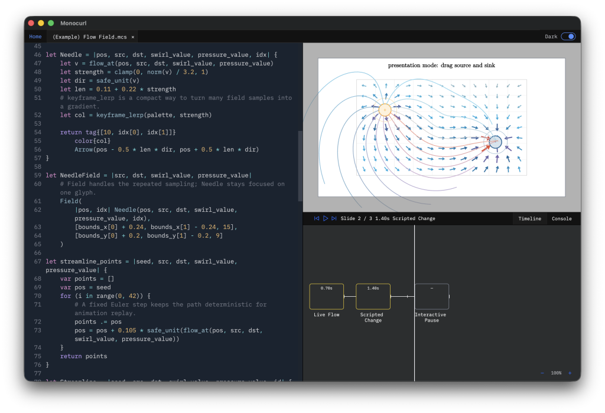

# Monocurl



Monocurl is a programming language and desktop application for creating mathematical animations interactively. It is capable of generating slideshows, videos, and images.

[Website and Download](https://monocurl.com) [Discord](https://discord.gg/7g94JR3SAD)

## What It Does

- Write scenes in the Monocurl language, a small language designed around meshes, animation state, and mathematical construction.
- Preview animations live in the desktop editor while editing source code.
- Export scenes as still images or videos from the same executable.
- Present scenes as slideshows with interactive parameters.
- Use built-in geometry, graphing, text, LaTeX, animation, and camera utilities.

## Minimal Example

```monocurl
import std.scene
import std.mesh
import std.color
import std.anim

slide "hello"
    mesh title = center{0u} Text("Monocurl", 2.4)
    play Write(1.2)
    play Wait(0.4)
    title = []
    play Fade(0.8)
```

## Building

Monocurl is a Rust workspace. The GUI currently targets macOS, Windows, and Linux.
See [BUILDING.md](BUILDING.md) for macOS, Linux, and Windows dependencies,
`pkg-config` setup, and the recommended `.cargo/config.toml` environment.

```sh
cargo run --package monocurl
```

The same binary also exposes CLI export commands, but these are somewhat WIP.

```sh
monocurl image scene.mcs
monocurl video scene.mcs
monocurl transcript scene.mcs
```

## Discord
Talk with us on the [Monocurl Discord](https://discord.gg/7g94JR3SAD) for showcasing your work, help, and discussion.
